# UVChecker-map

**UVChecker-map** is a collection of free images what can be helpful for unwrapping 3D models.

Repozitory contains
- 512x512 images in png format
- 1024x1024 images in png format
- Source files in psd format
- icons for GTools scrpt (WIP) in bmp format
- preview images and preview template in psd format

- - -

#### Preview

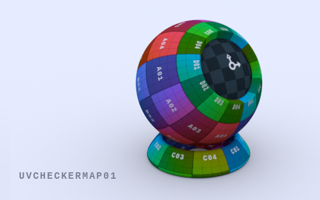
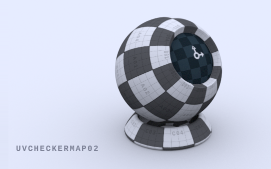
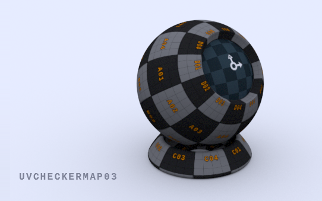
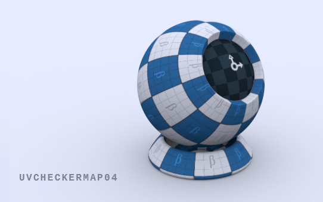
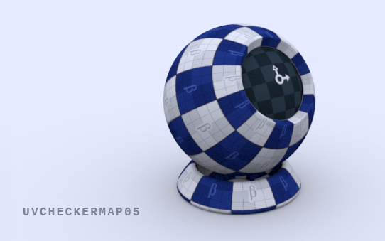
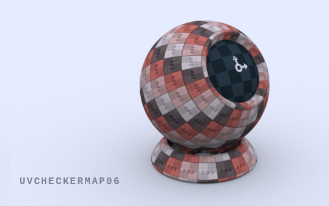
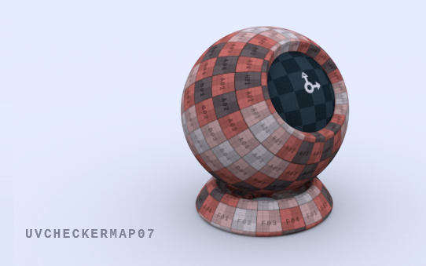
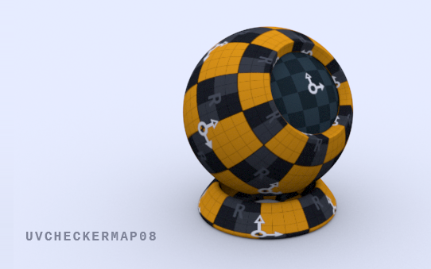
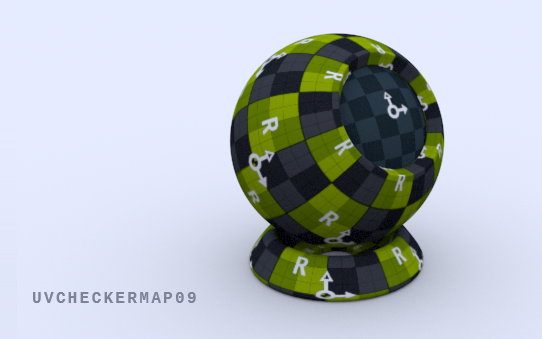

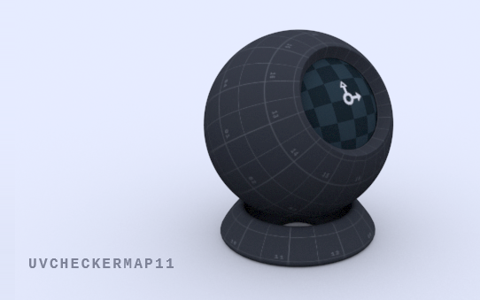
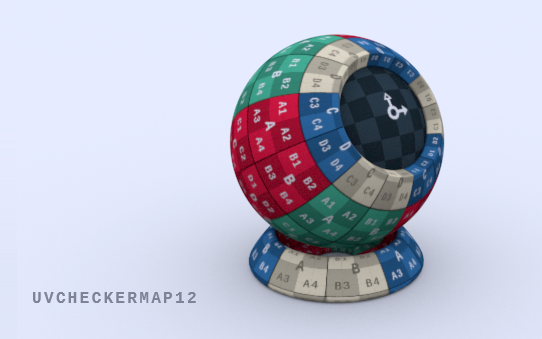
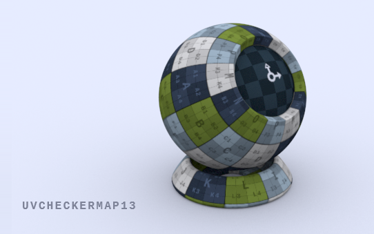
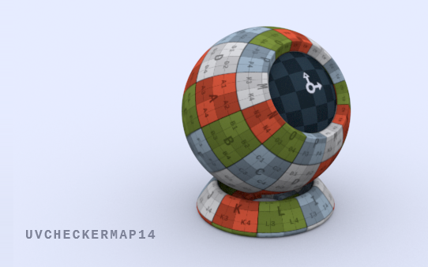
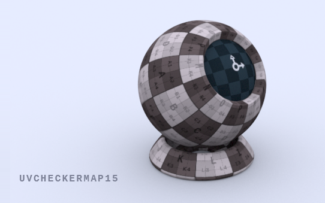

- - -

 
This work (UVChecker-map, by <a href="https://github.com/Arahnoid/UVChecker-map/issues/1" rel="dct:creator">Igor Grinchesku</a>) is free of known copyright restrictions.

---
